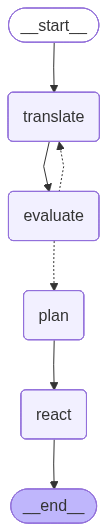

# telegram-data-agent

LangGraph-based data agent for ingesting Telegram channel messages, transforming them (translate/parse/tag), and then persisting or notifying based on match criteria.

Target runtime: AWS Lambda.

## Architecture Overview

The agent processes incident reports through a multi-node LangGraph pipeline:

1. **Translate Node** – Translates Hebrew Telegram messages to English using Groq LLM
2. **Evaluate Node** – Scores translation quality and provides feedback for refinement
3. **Plan Node** – Analyzes translated text to extract structured incident data (location, crime type) and determines if email alerts are needed
4. **Worker Node** – ReAct-style agent that executes tools based on the plan:
   - `push_to_dynamodb` – Stores incidents in monthly partitions with deduplication
   - `send_email` – Sends styled HTML alerts via AWS SES for high-priority incidents

### Key Design Decisions

- **Timestamps generated at tool execution** – Each tool generates its own ISO 8601 timestamp locally, avoiding state synchronization issues
- **Idempotent DynamoDB writes** – Incidents are deduplicated using a hash of location + crime + timestamp
- **Monthly partitions** – DynamoDB items are organized by year-month for efficient querying

## What This Repo Contains

- A LangGraph graph entrypoint defined in [langgraph.json](langgraph.json) and implemented in [src/agent/graph.py](src/agent/graph.py)
- Unit tests under [tests/](tests/)
- Project-wide engineering rules for agents in [.github/AGENTS.md](.github/AGENTS.md)

## Installation

Python 3.11+ is required.

Create and activate a virtual environment, then install the package in editable mode:

- `python -m venv .venv`
- `source .venv/bin/activate`
- `python -m pip install -U pip`
- `python -m pip install -e ".[dev]"`

Notes:

- `.[dev]` installs developer tooling (Ruff, Pyright, pytest, codespell, LangGraph CLI).
- The LangGraph CLI uses [langgraph.json](langgraph.json) and will load environment variables from `.env` if present.

## Linting, Formatting, Type Checking, and Spelling

Run these from the repository root:

- Lint: `ruff check .`
- Format: `ruff format .`
- Type check: `pyright`
- Unit tests: `pytest`
- Spell check: `codespell --toml pyproject.toml`

There are also Make targets:

- `make lint`
- `make format`
- `make test`
- `make spell_check`

## Running the LangGraph Dev Server ("LangSmith backend")

For local development, you can run the LangGraph dev server:

- `langgraph dev`

This uses [langgraph.json](langgraph.json) to locate the graph (`agent`) and will load `.env` automatically (as configured in `langgraph.json`).

If you want traces in LangSmith, set the relevant LangSmith environment variables in `.env` (or your shell) before starting `langgraph dev`.

## Running the Python Agent Locally

For a quick manual smoke test, run the module entry point:

- `python -m agent`

This invokes the graph with a minimal sample input and prints the result. For more thorough validation, prefer unit tests under [tests/](tests/).

## Environment Variables

Copy `.env.example` to `.env` and configure:

| Variable                 | Description                                          | Required |
| ------------------------ | ---------------------------------------------------- | -------- |
| `GROQ_API_KEY`           | Groq API key for LLM access                          | Yes      |
| `GROQ_MODEL_NAME`        | Groq model (default: `llama-3.3-70b-versatile`)      | No       |
| `LANGCHAIN_PROJECT`      | LangSmith project name for tracing                   | No       |
| `LANGSMITH_API_KEY`      | LangSmith API key                                    | No       |
| `AWS_ACCESS_KEY_ID`      | AWS credentials                                      | Yes      |
| `AWS_SECRET_ACCESS_KEY`  | AWS credentials                                      | Yes      |
| `AWS_REGION`             | AWS region (default: `us-east-1`)                    | No       |
| `DYNAMODB_TABLE_NAME`    | DynamoDB table for incident storage                  | Yes      |
| `DYNAMODB_PARTITION_KEY` | Partition key attribute name (default: `year_month`) | No       |
| `SES_SENDER_EMAIL`       | Verified SES sender email                            | Yes      |
| `SES_RECIPIENT_EMAIL`    | Alert recipient email                                | Yes      |

## Graph Visualization

Generate a PNG of the graph structure:

- `make graph_png`

Output is saved to `static/graph.png`.
